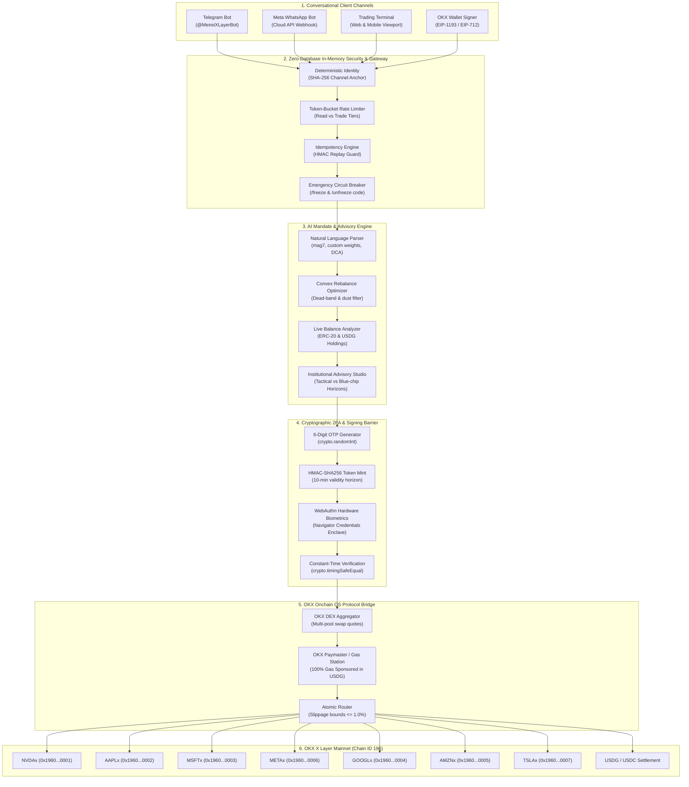
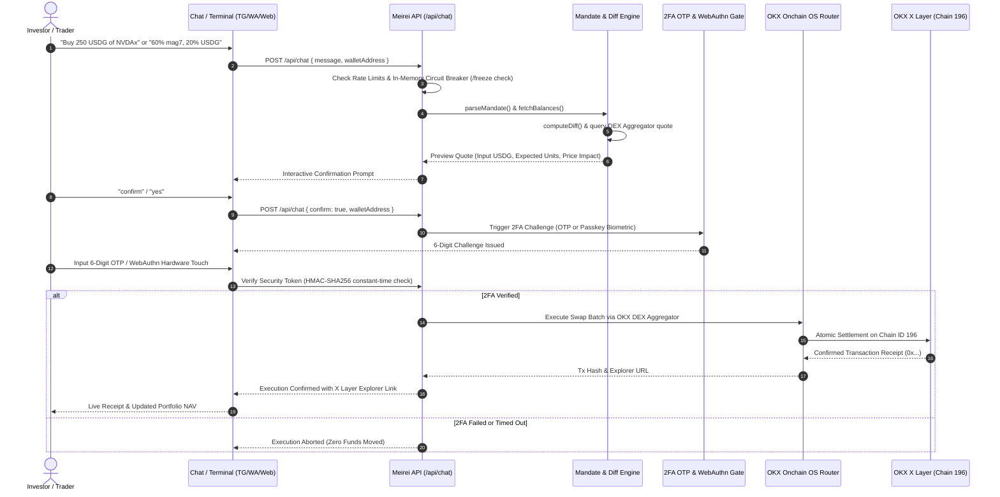
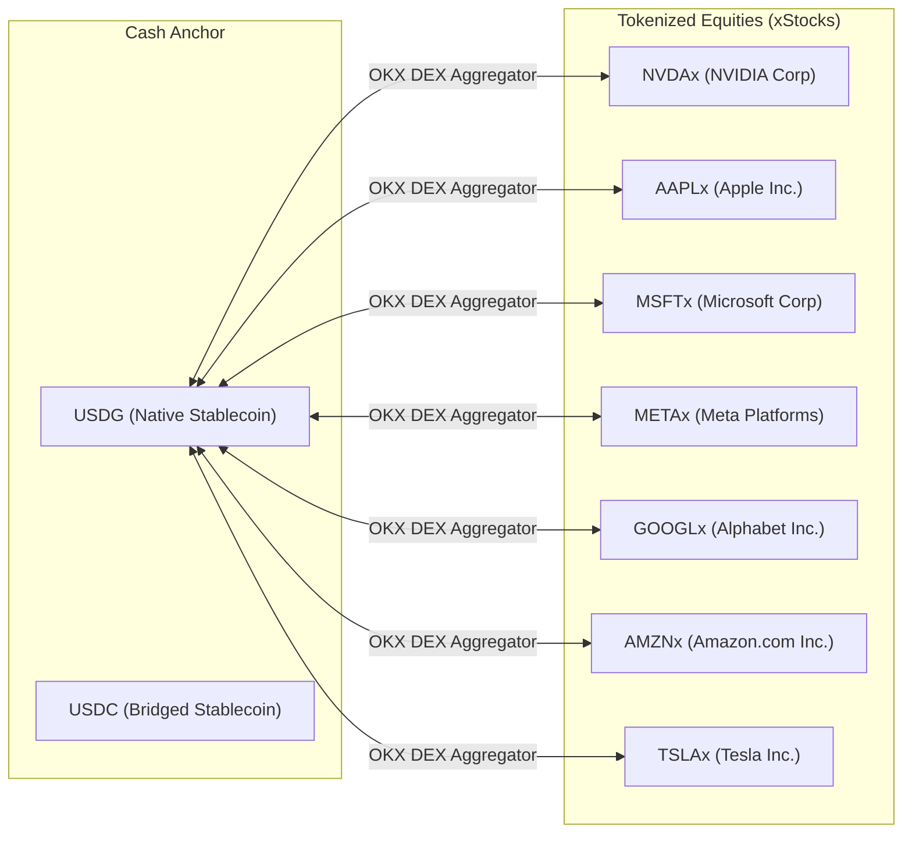

# Meirei Protocol — Rendered Architecture

Network: OKX X Layer Mainnet (Chain ID 196)  
Protocol: OKX Onchain OS AI Mandate Protocol  

Meirei is an autonomous, non-custodial AI investment mandate execution platform for tokenized equities on OKX X Layer. It coordinates conversational interfaces, zero-database in-memory security gates, the OKX Onchain OS protocol suite, and OKX DEX Aggregation.

---

## 1. End-to-End System Architecture (Rendered Flowchart)

---

## 2. Transaction Lifecycle Sequence Diagram

---

## 3. Component Architecture Matrix

| Layer | Component | Responsibility | Input | Output |
|---|---|---|---|---|
| **Conversational Frontend** | `src/cli.ts` & `app/app/page.tsx` | Accepts mandate directives, renders interactive tables and charts | Text string | Structured mandate payload |
| **Parsing Engine** | `src/mandate/parse.ts` | Normalizes freeform input into target weight distributions | Natural language string | `Mandate { targets, cashSymbol, band }` |
| **Convex Diff Optimizer** | `src/portfolio/diff.ts` | Calculates minimal-trade rebalance legs with dust filters | `Mandate` + `Holding[]` | `Leg[] (side, symbol, notionalUsd)` |
| **Balance Analytics** | `src/portfolio/balances.ts` | Aggregates on-chain balances and portfolio valuation | Wallet address | `Holding[]` + Total NAV |
| **Onchain OS Bridge** | `src/onchainos/index.ts` | Dispatches swap quotes and execution via OKX protocol | `onchainos` CLI / RPC | `Quote[]` and on-chain tx hashes |
| **Security & Identity** | `lib/auth/user_identity.ts` | In-memory deterministic identity resolution without databases | Email / Chat handle | Non-custodial session profile |
| **2FA Verification** | `lib/auth/otp.ts` | Issues & validates constant-time HMAC-SHA256 OTP tokens | 6-digit code | Verified execution token |
| **Hardware Biometrics** | `components/wallet/web3_signing_modal.tsx` | Native WebAuthn biometric hardware signing | Hardware biometric | Digest signature reference |
| **DEX Routing** | OKX DEX Aggregator | Best-execution routing on X Layer | Source/destination tokens | On-chain settlement |
| **Settlement Rails** | OKX X Layer (Chain 196) | Final settlement of tokenized equities | Smart contract call | Immutable block receipt |

---

## 4. Allowlisted xStocks Asset Universe

All assets settle natively against `USDG` on OKX X Layer (Chain ID 196):

---

## 5. Security & Circuit Breaker Model

- **Zero-Database Operation**: Identity and security token records operate completely in-memory with deterministic SHA-256 derivation.
- **Emergency Panic Directive**: Sending `/freeze` from Telegram, WhatsApp, or Web immediately revokes active authorization tokens.
- **Cryptographic Unfreeze**: Restoring active trading status requires providing the exact 6-digit recovery code generated during freezing (`/unfreeze <code>`).
- **Gas Sponsorship**: All swap gas costs are sponsored via the OKX Paymaster / Gas Station on X Layer.
